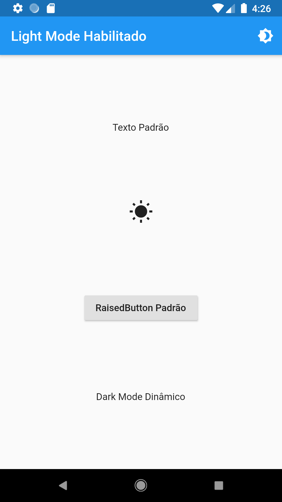
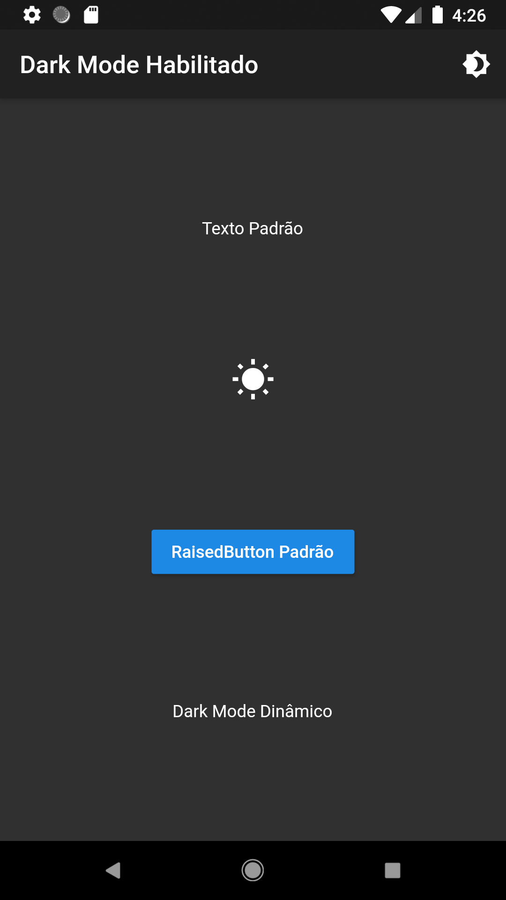

In this article I will present a method of implementing dynamic Dark Mode on Flutter using `ThemeMode` and the plugin `provider`.

There are many ways to apply the dynamic theme to [Flutter](/categories/flutter/), but the plugin provider is one of the best and most efficient ways I am using in FluCast.

The plugin provider is a mix between Dependency Injection (DI) and state management, built with widgets for widgets.

It purposely uses widgets for DI / state management instead of Dart classes like Stream. The reason is that widgets are very simple but robust and scalable and for those who use Flutter is more natural.

By using state management widgets, the provider can ensure:

- Maintenance, through a unidirectional data flow;
- Testability / composition, as it is always possible to mock / override a value;
- Robustness as it is harder to forget to deal with the upgrade scenario of a model or widget.

To read more about the provider, see the [documentation](https://pub.dev/packages/provider).

## Dark Mode Example

In this example we will use Flutter's native `ThemeMode` to control the Dark Mode and **_Light Mode_** of the app you have in some apps, such as reading apps where **_Light Mode_** is for the day and **_Dark Mode_** is for the night.

You may also have noticed that Google Maps has the same feature for night and day modes, which turn on and off automatically according to the light. It is an increasingly common resource today.

Add the provider plugin to the pubspec.yaml file:

```yaml
dependencies:
 Flutter:
   sdk: Flutter
 provider: ^4.0.1
```

Now let's create a new file for implementation of ThemeProvider. I created a file called theme.dart where will be the DynamicDarkMode class:

```dart
import 'package:flutter/foundation.dart';

/// Provider para o Dark Mode
class DynamicDarkMode with ChangeNotifier {
  /// Por padrão o App Começa com o modo Light Mode
  /// Você pode configurar um método de persistir o valor de
  /// [_isDarkMode] para que ele seja preservado quando o app for fechado
  bool _isDarkMode = false;

  /// Verifica se o App está em Dark Mode
  get isDarkMode => this._isDarkMode;

  /// Aplica o Dark Mode
  void setDarkMode() {
    this._isDarkMode = true;
    notifyListeners();
  }

  /// Aplica o Light Mode
  void setLightMode() {
    this._isDarkMode = false;
    notifyListeners();
  }
}
```

Now open the main.dart file and deploy ChangeNotifier to the entire application so we can change the theme from anywhere in the application.

Basically you need to change the main () method to look like this:

```dart
void main() async => runApp(
      // Aqui rodamos o app dentro do provider
      ChangeNotifierProvider<DynamicDarkMode>(
        create: (_) => DynamicDarkMode(),
        child: MyHomePage(),
      ),
    );
```

I implemented an option to switch between dark and light mode of the theme. Following is the implementation of programming.

## Reading Provider Data

The plugin provider offers the Provider.of (context) method that allows us to read our MaterialApp data and can be accessed anywhere:

```dart
// Aqui capturamos os dados do nosso ThemeProvider
final themeProvider = Provider.of<DynamicDarkMode>(context);
```

## Dark Mode Final Code

See what the app will look like with the modified main () method and build () reading the provider data.

The sample app is available on github.

```dart
import 'package:flutter/material.dart';
import 'package:provider/provider.dart';
import 'theme.dart';

void main() async => runApp(
      // Aqui rodamos o app dentro do provider
      ChangeNotifierProvider<DynamicDarkMode>(
        create: (_) => DynamicDarkMode(),
        child: MyHomePage(),
      ),
    );

class MyHomePage extends StatefulWidget {
  @override
  _MyHomePageState createState() => _MyHomePageState();
}

class _MyHomePageState extends State<MyHomePage> {
  @override
  Widget build(BuildContext context) {
    // Aqui capturamos os dados do nosso ThemeProvider
    final themeProvider = Provider.of<DynamicDarkMode>(context);
    return MaterialApp(
      debugShowCheckedModeBanner: false,
      // Habilita o suporte ao Dark Mode no MaterialApp
      darkTheme: ThemeData.dark(),
      // Informa o status do Dark Mode ap MaterialApp
      themeMode: themeProvider.isDarkMode ? ThemeMode.dark : ThemeMode.light,
      home: Scaffold(
        appBar: AppBar(
          title: Text(
            themeProvider.isDarkMode
                ? 'Dark Mode Habilitado'
                : 'Light Mode Habilitado',
          ),
          actions: <Widget>[
            // action button
            IconButton(
              icon: Icon(Icons.brightness_4),
              onPressed: () {
                // Aqui alteramos o status do Dark Mode
                // e o Provider se encarrega de avisar ao MaterialApp
                setState(
                  () {
                    themeProvider.isDarkMode
                        // Configura como Light Mode
                        ? themeProvider.setLightMode()
                        // Configura como Dark Mode
                        : themeProvider.setDarkMode();
                  },
                );
              },
            ),
          ],
        ),
        body: Center(
          child: Column(
            mainAxisAlignment: MainAxisAlignment.spaceEvenly,
            children: <Widget>[
              Spacer(),
              Text('Texto Padrão'),
              Spacer(),
              Icon(
                Icons.wb_sunny,
                size: 36.0,
              ),
              Spacer(),
              RaisedButton(
                child: Text('RaisedButton Padrão'),
                onPressed: () {},
              ),
              Spacer(),
              Text('Dark Mode Dinâmico'),
              Spacer(),
            ],
          ),
        ),
      ),
    );
  }
}
```

Run the project on the device and test the application with the code that is in Github. You can customize the theme as per your requirement.





## Conclusion

In this article, we learned how to implement the dynamic theme in Flutter using the provider.

This example is basic and easy to understand and you can make it fully customized by implementing other theme properties in the provider file. You can also store theme settings in shared preferences to keep the settings active after closing and reopening the app.
